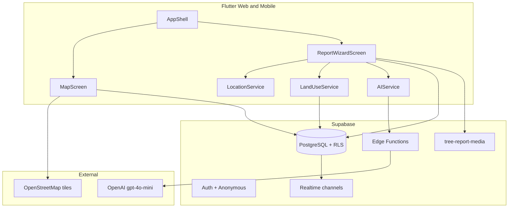
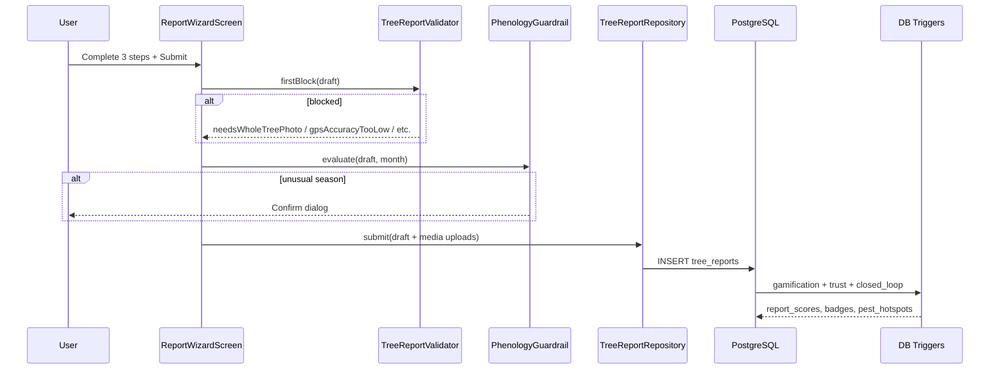

# UrbanTree — System Handoff Documentation

**4th-Year Engineering Project** — Monitoring urban forest physiology and bridging the **Urban Data Gap**, specifically the **Private Land Black Box**, through Citizen Science, High-Precision GPS, and Vision AI (OpenAI).

| Document | Purpose |
|----------|---------|
| This file (`root/HANDOFF.md`) | Architecture, science, database, credentials, deployment |
| [`MAPPING_PROTOCOL.md`](MAPPING_PROTOCOL.md) | Field protocol for reporters |
| [`urban_tree/docs/DEPLOYMENT_CHECKLIST.md`](../urban_tree/docs/DEPLOYMENT_CHECKLIST.md) | Store signing, CORS, privacy |

---

## 1. System Architecture & GIS Overview

### 1.1 Stack summary



| Layer | Technology | Key paths |
|-------|------------|-----------|
| Client | Flutter 3.11+ (Web, Android, iOS) | `urban_tree/lib/main.dart`, `urban_tree/lib/presentation/shell/app_shell.dart` |
| Map | flutter_map + OpenStreetMap | `urban_tree/lib/presentation/map_screen.dart` |
| Backend | Supabase PostgreSQL, Auth, Storage, Realtime | `urban_tree/supabase/migrations/` (16 files) |
| Serverless | Deno Edge Functions | `openai-suggest`, `openai-tree-insights`, `data-quality-weekly` |
| AI | OpenAI gpt-4o-mini | Proxied via Edge Functions on web; optional direct on mobile |

**Bootstrap flow** (`urban_tree/lib/main.dart`):

1. `AppEnv.load()` — resolve `SUPABASE_URL`, `SUPABASE_ANON_KEY`, optional `OPENAI_API_KEY`
2. `Supabase.initialize()` (25 s timeout)
3. `AuthGateScreen` → anonymous or email auth → `AppShell` (Home, Identify, Collection, Map, Journal)

### 1.2 GIS architecture — multi-layered land-use classification

UrbanTree solves the **Private Land Black Box** by auto-classifying each report's land tenure at GPS capture time. The GIS layer is **not** true cadastral polygon geometry; it uses **axis-aligned bounding boxes** stored in `land_zones`.

**Data model** (`public.land_zones`):

| Column | Role |
|--------|------|
| `min_lat`, `max_lat`, `min_lon`, `max_lon` | Axis-aligned bounding box |
| `land_type` | `public`, `private`, `kkl`, `abandoned` |
| `layer_priority` | Higher wins when boxes overlap |
| `label` | Human-readable zone name |

**Classification algorithm** (`urban_tree/lib/services/land_use_service.dart` → `LandUseService.classify()`):

1. Fetch all zones from Supabase, ordered by `layer_priority` descending.
2. Filter zones whose bounding box **contains** the GPS point.
3. Sort matches: **highest `layer_priority` first**; on tie, **smallest bounding-box area** (`areaDegrees2`) wins — the most specific parcel enclave.
4. Return `LandUseClassification(type, automatic: true, zoneLabel)`.

**Why smallest area on tie-break:** A large public corridor box may fully contain a small private garden enclave at the same priority. Smallest area selects the parcel-scale zone, which is the scientific requirement for distinguishing public street trees from private-garden specimens.

**Rendering:** `LandZone.boundingPolygon` draws tinted overlays on the map (`PolygonLayer` in `map_screen.dart`). This is visualization only; classification uses point-in-box logic.

**Pre-wizard orchestration** (`urban_tree/lib/presentation/report/report_flow_launcher.dart`):

```
User taps Report → ensure auth → high-accuracy GPS fix → LandUseService.classify()
  → TreeReportDraft(landType, landTypeAuto) → ReportWizardScreen
```

If no zone matches, draft defaults to `LandUseType.public` with `landTypeAuto: false` (user may override manually; no +5 land-use points).

**Python mirror:** `urban_tree/scripts/import_tel_aviv_trees.py` replicates the same classify rule for municipal tree imports.

### 1.3 Report submission data flow



---

## 2. Core Scientific Implementations

### 2.1 Three-step reporting wizard protocol

Aligned with [`MAPPING_PROTOCOL.md`](MAPPING_PROTOCOL.md) and synced to `public.tree_reports`. Implemented in `urban_tree/lib/presentation/report/report_wizard_screen.dart`.

| Step | Index | Physiological focus | Submit requirement |
|------|-------|-------------------|-------------------|
| **1 — Whole tree** | `_step == 0` | Species, vision/text AI, health (1–5), hazard assessment, canopy density, structural issues | ≥1 whole-tree photo |
| **2 — Flower/fruit** | `_step == 1` | Optional photos; phenological stage (`bud`/`open`/`fruit`); abundance (`low`/`medium`/`high`) | If photos present → stage + abundance required |
| **3 — Leaves** | `_step == 2` | Leaf condition, stress symptom chips, damage extent | ≥1 leaves photo |

**Shared UI (all steps):** land-use dropdown with GIS auto-hint, phenology warning banner, GPS accuracy warning card (>2 m), linear progress bar, live points preview via `ReportScoringService.pointsForDraft`.

**Pre-wizard context:** Up to 500 nearby reports loaded for duplicate-tree warnings within **50 m** (`kNearbyDuplicateWarnMeters`).

### 2.2 Multi-Tier Validation Protocol

| Tier | Name | Mechanism | Scientific rationale |
|------|------|-----------|---------------------|
| **Tier 1** | Algorithmic Phenology Guardrail + client hard blocks | `phenology_guardrail.dart` + `tree_report_validator.dart` | Reject incomplete physiological data; flag biologically implausible flowering/fruiting months per species (`assets/data/species_phenology.json`); optional client GPS block at **>2 m** when `BLOCK_SUBMIT_IF_LOW_ACCURACY=true` |
| **Tier 2** | User Trust Score | Server trigger `tree_reports_trust_score_after_insert` → `recompute_profile_trust_score()` | Reward data completeness and penalize duplicate-grid clustering; feeds trust-aware leaderboard |
| **Server gate** | Closed-loop enforcement | `tree_reports_closed_loop_after_insert` | **Always** rejects `accuracy_meters > 2` regardless of client flag — hard scientific gate for cadastral-grade coordinates |

**Tier 1 — Client hard blocks** (`TreeReportValidator.firstBlock`):

| Block reason | Condition |
|--------------|-----------|
| `needsWholeTreePhoto` | No whole-tree images |
| `needsFlowerMeta` | Flower images without stage or abundance |
| `needsLeavesPhoto` | No leaves images |
| `gpsAccuracyTooLow` | `accuracyMeters > 2.0` when `AppEnv.blockSubmitIfLowAccuracy` is true |

**Tier 1 — Phenology guardrail** (soft confirm, not hard block): On submit, if reported stage (bud/open/fruit) falls outside species-specific month windows, user must confirm via dialog.

**Tier 2 — Trust score formula** (0–100, recomputed after each report):

```
trust_score = clamp(0, 100,
  20                                                           -- base
  + 30 × completeness_ratio                                    -- last 30 reports, 8 fields
  + 25 × avg_species_confidence                                -- AI confidence cap 1.0
  + 15 × (1 - duplicate_grid_ratio)                            -- penalize same ~100m grid repeats
  + 10 × (1 - open_quality_flag_ratio)                         -- global quality signal
)
```

**Leaderboard ranking:** `leaderboard_score = (total_points × 0.8) + (trust_score × 2.0)`

**Soft warnings (non-blocking):**

| Warning | Threshold | Location |
|---------|-----------|----------|
| GPS accuracy banner | `accuracyMeters > 2.0` | Wizard dismissible card |
| Nearby duplicate trees | **50 m** | Pre-camera dialog on step 0 |
| Pest proximity | Within hotspot `radius_m` (default **500 m**) | Map banner, 15-min cooldown per hotspot |

### 2.3 Closed-Loop Feedback model

**Pest hotspot overlays (500 m radius):**

- Table `public.pest_hotspots`: `radius_m` default **500**, `active`, `pest_code`, `label`, `severity`
- `PestHotspotService.fetchActive()` — client read via RLS (`active = true`)
- `MapScreen` — orange circle overlays (`useRadiusInMeter: true`), proximity banner when user GPS is inside radius

**Auto-creation from reports** (`tree_report_closed_loop_after_insert`):

- When `stress_symptoms` contains `'pest_damage'` → insert hotspot at report coordinates, 500 m radius, `pest_code: 'red_palm_weevil'`, `source: 'report:<id>'`

**Weekly data-quality scan** (`data-quality-weekly` Edge Function):

- Triggered via `pg_cron` (Sundays 02:00 UTC) or manual HTTP with `x-data-quality-secret`
- Scans last **8000** reports, clusters by lat/lon rounded to 5 decimals
- Flags:
  - `health_score_variance` — stddev(health_score) ≥ **1.25** in cluster with ≥2 reports
  - `phenology_conflict_14d` — multiple phenological stages within **14 days** at same cluster
- Inserts into `data_quality_flags` (feeds research dashboard and trust score)

### 2.4 Gamification scoring

**Client preview** (`ReportScoringService`) mirrors server trigger `tree_report_gamification_after_insert`:

| Component | Points | Condition |
|-----------|--------|-----------|
| Base | **10** | Always (whole-tree step completed) |
| Flower/fruit | **+15** | `flower_image_urls` non-empty |
| Leaves | **+10** | `leaves_image_urls` non-empty |
| Land-use auto-match | **+5** | `land_type_auto = true` (GIS classified) |
| **Maximum** | **40** | |

**Badges** (granted server-side via `grant_user_badge()`):

| Badge code | Trigger |
|------------|---------|
| `first_blossom_reporter` | First report with phenological stage bud/open/fruit |
| `private_land_pioneer` | First `land_type = 'private'` report |
| `first_bloom_hunter` | First bud/open for a species in reporter's city |
| `neighborhood_watch` | ≥5 reports at same lat/lon grid (3 decimal places, ~100 m) |

**Client display:** `BadgeService.myBadges()` on profile screen.

### 2.5 Vision AI pipeline

**Routing** (`AIService`):

| Platform | Path |
|----------|------|
| Web | Always Edge Function `openai-suggest` (no client OpenAI key) |
| Mobile + `OPENAI_API_KEY` set | Direct OpenAI gpt-4o-mini |
| Mobile + no key | Edge Function fallback |

**Post-submit insights:** Edge Function `openai-tree-insights` (all platforms).

**Preprocessing:** Resize to max **896 px**, JPEG quality **82** — balances token cost vs. diagnostic detail.

**Multilingual normalization:** Model outputs canonical `species_common_en` + `species_scientific_latin`; `translated_display_name` for UI locale; `source_language` (BCP-47). User must confirm before applying; audit stored in `ai_suggestion_json`.

---

## 3. Database State & Topology

### 3.1 Table inventory

| Table | Purpose | Key columns |
|-------|---------|-------------|
| `profiles` | User identity, gamification, trust | `id` → `auth.users`, `display_name`, `city_slug`, `total_points`, `trust_score`, `avatar_url` |
| `tree_reports` | Core citizen-science observations | `latitude`, `longitude`, `accuracy_meters`, `land_type`, `land_type_auto`, physiological fields, `species`, `species_scientific`, `species_confidence`, `ai_suggestion_json`, `stress_symptoms[]`, `hazard_assessment`, `geom` (PostGIS, generated) |
| `report_scores` | Per-report point breakdown | `report_id` PK, `points_breakdown` jsonb, `total` |
| `user_badges` | Earned achievements | `user_id`, `badge_code`, UNIQUE(user_id, badge_code) |
| `badge_definitions` | Badge catalog | `badge_code`, `title`, `description`, `category` |
| `pest_hotspots` | Active pest alert zones | `pest_code`, `latitude`, `longitude`, `radius_m` (default 500), `active`, `source` |
| `data_quality_flags` | Research quality anomalies | `cluster_key`, `reason`, `payload` jsonb, `status` |
| `land_zones` | GIS bounding boxes | `land_type`, bbox coords, `layer_priority` |

**Views:**

| View | Purpose |
|------|---------|
| `leaderboard_national` | National ranking with `leaderboard_score` |
| `leaderboard_city` | Per-city ranking |
| `species_report_counts` | Species frequency for map "hidden gem" hints |

### 3.2 Triggers

| Trigger | Table | Timing | Function | Purpose |
|---------|-------|--------|----------|---------|
| `on_auth_user_created` | `auth.users` | AFTER INSERT | `handle_new_user()` | Create `profiles` row |
| `tree_reports_gamification_after_insert` | `tree_reports` | AFTER INSERT | `tree_report_gamification_after_insert()` | 10+15+10+5 scoring, badges |
| `tree_reports_trust_score_after_insert` | `tree_reports` | AFTER INSERT | `tree_reports_trust_score_after_insert()` | Recompute `profiles.trust_score` |
| `tree_reports_flower_metadata` | `tree_reports` | BEFORE INSERT/UPDATE | `enforce_flower_metadata()` | Flower photos require stage + abundance |
| `tree_reports_species_standardization` | `tree_reports` | BEFORE INSERT/UPDATE | `standardize_tree_reports_species()` | pg_trgm species normalization |
| `tree_reports_closed_loop_after_insert` | `tree_reports` | AFTER INSERT | `tree_report_closed_loop_after_insert()` | GPS ≤2 m enforcement; pest hotspot auto-creation |

### 3.3 Row-Level Security (RLS) summary

| Table | SELECT | INSERT | UPDATE |
|-------|--------|--------|--------|
| `profiles` | Public (leaderboard) | Own (`auth.uid() = id`) | Own |
| `tree_reports` | Public | Authenticated, `user_id = auth.uid()` | Own |
| `report_scores` | Public | — (trigger only) | — |
| `user_badges` | Own + public read | — (trigger only) | — |
| `pest_hotspots` | Active only | — (trigger/seed) | — |
| `data_quality_flags` | Public | Service role only (Edge Function) | — |
| `badge_definitions` | Active only | — | — |
| `land_zones` | Public | — | — |
| `storage.objects` (bucket `tree-report-media`) | Public read | Authenticated upload | Own update |

### 3.4 Migration chronology (16 files)

| Migration | Purpose |
|-----------|---------|
| `20260401100000_initial_schema.sql` | `land_zones`, `tree_reports`, storage bucket, demo zones |
| `20260412120000_production_hardening_notes.sql` | Photo minimums, flower metadata trigger |
| `20260413100000_gamification_platform.sql` | Profiles, scoring, badges, pest hotspots, quality flags |
| `20260415120000_tree_import_provenance_geom.sql` | Import provenance, PostGIS `geom` |
| `20260416100000_tree_reports_ai_fields_backfill.sql` | AI column backfill |
| `20260416101000_postgrest_reload_schema.sql` | PostgREST schema reload |
| `20260416120000_species_standardization_pgtrgm.sql` | `pg_trgm`, species normalization |
| `20260416123000_tree_reports_species_confidence_backfill.sql` | `species_confidence` backfill |
| `20260416124000_tree_reports_user_id_backfill.sql` | `user_id` backfill |
| `20260416125000_gamification_platform_backfill.sql` | Idempotent gamification backfill |
| `20260417100000_auth_profiles_trust_leaderboard.sql` | Trust score, leaderboard views |
| `20260417113000_gamification_badges_hardening.sql` | `badge_definitions`, `grant_user_badge()` |
| `20260417114000_tree_reports_stress_symptoms.sql` | `stress_symptoms` array |
| `20260417115000_closed_loop_alerts_accuracy.sql` | GPS enforcement, pest auto-hotspots |
| `20260417120000_tree_reports_hazard_assessment.sql` | `hazard_assessment` column |
| `20260417120000_restore_granular_gamification_scoring.sql` | Restore 10+15+10+5 scoring |

> **Note:** Two migrations share the `20260417120000` timestamp prefix (`hazard_assessment` vs `restore_granular_gamification_scoring`). Apply in filename order; both are required.

### 3.5 PostgreSQL extensions

| Extension | Used for |
|-----------|----------|
| `pgcrypto` | UUID generation |
| `postgis` | `tree_reports.geom` generated column |
| `pg_trgm` | Species fuzzy matching / standardization |
| `pg_cron` | Weekly data-quality job scheduling |
| `pg_net` | HTTP calls from cron to Edge Functions |

---

## 4. Credentials & Environment

### 4.1 Variable inventory

| Variable | Where set | Consumed by | Required |
|----------|-----------|-------------|----------|
| `SUPABASE_URL` | `secrets.json`, Vercel env, `urban_tree/.env` | Flutter `--dart-define`, Edge Functions (auto-injected) | **Yes** |
| `SUPABASE_ANON_KEY` | Same | Flutter client, Edge auth headers | **Yes** |
| `OPENAI_API_KEY` | `secrets.json` (mobile optional), Supabase secrets | `AIService` (mobile direct), `openai-suggest`, `openai-tree-insights` | Web: Supabase secrets only |
| `APP_ENV` | `secrets.json` | `AppEnv.isProd` | No (default `dev`) |
| `BLOCK_SUBMIT_IF_LOW_ACCURACY` | `secrets.json` | Client submit gate only | No (code default `true`; example file `false`) |
| `SUPABASE_SERVICE_ROLE_KEY` | `.env` / Supabase secrets | `data-quality-weekly`, import scripts | Edge + scripts |
| `DATA_QUALITY_CRON_SECRET` | Supabase secrets + Vault | Cron HTTP header `x-data-quality-secret` | Weekly scan |
| `SUPABASE_ACCESS_TOKEN` | `.env` (CLI only, gitignored) | `supabase_backend_deploy.sh` | CLI deploy |
| `SUPABASE_DB_PASSWORD` | Shell export | First-time `db push` / link | First deploy |
| `SUPABASE_PROJECT_REF` | Derived from URL or shell | CLI link/deploy | Deploy |

**Server-only (never in Flutter app):** `SUPABASE_SERVICE_ROLE_KEY`, `DATA_QUALITY_CRON_SECRET`, `SUPABASE_ACCESS_TOKEN`, `SUPABASE_DB_PASSWORD`.

### 4.2 Injection paths

```
Release / CI builds:
  secrets.json → --dart-define-from-file=secrets.json → AppEnv (compile-time)

Local debug/profile:
  --dart-define OR urban_tree/.env → debug_dotenv → AppEnv fallback

Vercel web build:
  Vercel env vars → scripts/vercel_build.sh → --dart-define=...

Supabase Edge Functions:
  supabase secrets set OPENAI_API_KEY=... SUPABASE_SERVICE_ROLE_KEY=... DATA_QUALITY_CRON_SECRET=...
```

### 4.3 Security rules

- **Never commit:** `secrets.json`, `urban_tree/.env`, keystores, service role keys, access tokens
- **Web OpenAI:** Must use Edge Functions — no client-side `OPENAI_API_KEY` in production web builds
- **GPS enforcement:** Server trigger always enforces ≤2 m; client `BLOCK_SUBMIT_IF_LOW_ACCURACY` is an additional UX gate
- **Production recommendation:** Set `"BLOCK_SUBMIT_IF_LOW_ACCURACY": "true"` in `secrets.json` for citizen-science data integrity

---

## 5. Deployment Guide

### 5.1 Local development

All Flutter commands run from `urban_tree/`:

```bash
cd urban_tree
flutter pub get
flutter analyze
flutter test
flutter run -d chrome          # Web
flutter run -d <device_id>       # Mobile (Android: add --flavor dev)
```

**Local env setup:**

```bash
cp .env.example .env
# Edit SUPABASE_URL, SUPABASE_ANON_KEY
```

### 5.2 Database migrations & Edge Functions

**Automated (recommended):**

```bash
cd urban_tree
npx supabase@latest login
# Optional: export SUPABASE_DB_PASSWORD='...' on first link
./scripts/supabase_backend_deploy.sh
```

This script: links project → `db push` → optional `secrets set` → deploys `openai-suggest`, `openai-tree-insights`, `data-quality-weekly`.

**Manual alternative:**

```bash
cd urban_tree
supabase link --project-ref <YOUR_PROJECT_REF>
supabase db push
supabase secrets set OPENAI_API_KEY=sk-... SUPABASE_SERVICE_ROLE_KEY=... DATA_QUALITY_CRON_SECRET=...
supabase functions deploy openai-suggest --use-api
supabase functions deploy openai-tree-insights --use-api
supabase functions deploy data-quality-weekly --use-api
```

**Post-deploy dashboard steps:**

1. Authentication → Providers → **Anonymous**: enable
2. API → CORS: add production web origin
3. SQL Editor: run `scripts/schedule_data_quality_weekly.sql` (after Vault secrets)
4. Verify: `select * from public.pest_hotspots where source = 'seed';`

### 5.3 Production web (Vercel)

```bash
cd urban_tree
npx vercel --prod
```

**Vercel project settings:**

| Setting | Value |
|---------|-------|
| Root directory | `urban_tree` |
| Build command | `bash scripts/vercel_build.sh` |
| Output | `build/web` |
| Env vars | `SUPABASE_URL`, `SUPABASE_ANON_KEY` (required); `APP_ENV`, `OPENAI_API_KEY` (optional) |

**Local production web build:**

```bash
cd urban_tree
cp secrets.json.example secrets.json  # fill values
./scripts/build_web_prod.sh
```

### 5.4 Mobile production builds

```bash
cd urban_tree
flutter build appbundle --flavor prod --release --dart-define-from-file=secrets.json
# iOS: flutter build ipa --release --dart-define-from-file=secrets.json
```

### 5.5 Verification checklist

```bash
# Flutter quality gates
cd urban_tree && flutter analyze && flutter test

# Optional SQL verification
select pest_code, latitude, longitude, radius_m from public.pest_hotspots where active;
select id, public from storage.buckets where id = 'tree-report-media';
select count(*) from public.land_zones;
```

---

## Appendix: Key file index

| Area | Path |
|------|------|
| GPS | `urban_tree/lib/services/location_service.dart` |
| GIS | `urban_tree/lib/services/land_use_service.dart` |
| Wizard | `urban_tree/lib/presentation/report/report_wizard_screen.dart` |
| Validator | `urban_tree/lib/services/tree_report_validator.dart` |
| Phenology | `urban_tree/lib/services/phenology_guardrail.dart` |
| AI | `urban_tree/lib/services/ai_service.dart` |
| Env | `urban_tree/lib/core/env.dart` |
| Scoring | `urban_tree/lib/services/report_scoring_service.dart` |
| Badges | `urban_tree/lib/services/badge_service.dart` |
| Map + pest alerts | `urban_tree/lib/presentation/map_screen.dart` |
| Deploy script | `urban_tree/scripts/supabase_backend_deploy.sh` |
| Vercel build | `urban_tree/scripts/vercel_build.sh` |
| Cursor rules | `root/.cursorrules` |

---

## Presentation & Demo Mode Configuration

The following parameters are active for the **live presentation release**. Restore production values after the demo.

| Adjustment | Implementation | Production value |
|------------|----------------|------------------|
| **Adaptive spatial threshold** | `kTargetLocationAccuracyMeters = 50.0` in `urban_tree/lib/core/constants.dart` | `kProductionLocationAccuracyMeters = 2.0` |
| **Headless GIS** | `LandUseService.classify()` runs at flow start and submit; `kShowLandUseMapOverlays = false` hides `PolygonLayer` on `MapScreen` | Overlays visible |
| **Live spatial anchoring** | `_anchorDraftToLiveGps()` in `report_wizard_screen.dart` re-fetches device GPS at submit; image EXIF GPS is never read | Same submit-time anchor |
| **Graceful degradation** | `PresentationFallbackService` injects mock AI suggestions, report IDs, and insight tips on Supabase/OpenAI/network failures | Fail-fast errors |

**Files:** `constants.dart`, `map_screen.dart`, `land_use_service.dart`, `report_wizard_screen.dart`, `presentation_fallback_service.dart`, `ai_service.dart`.
